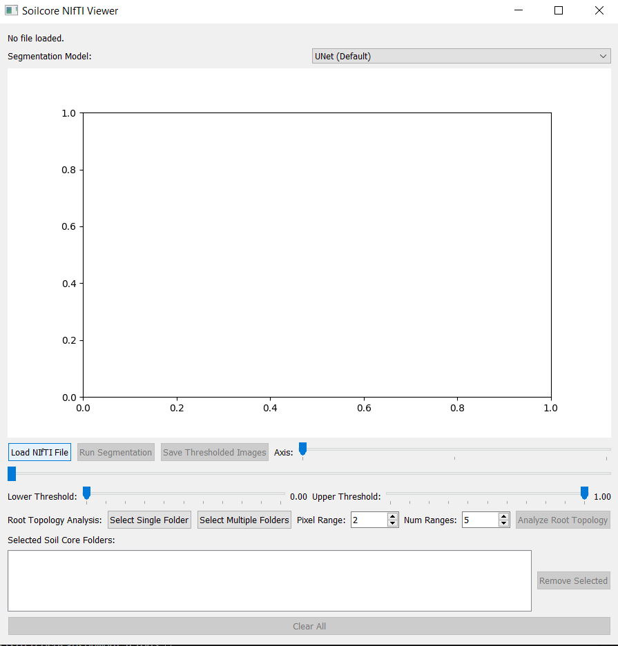
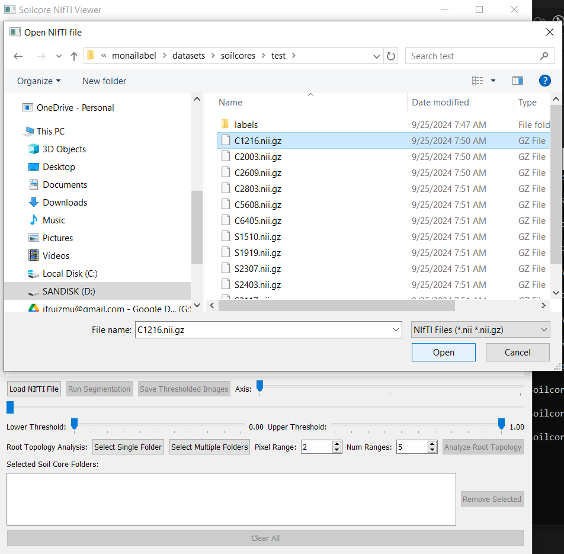
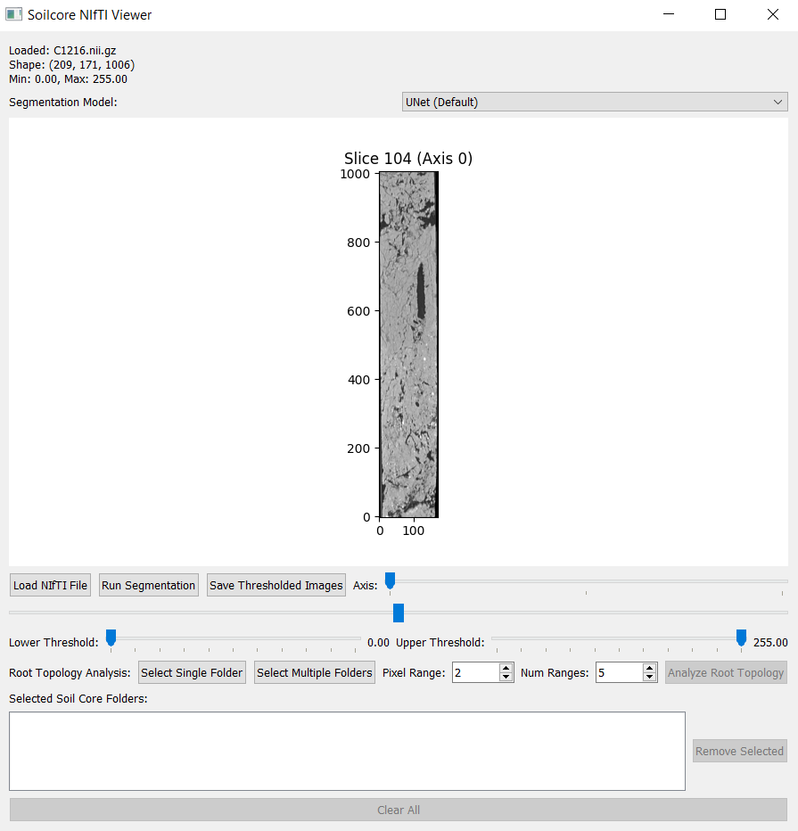
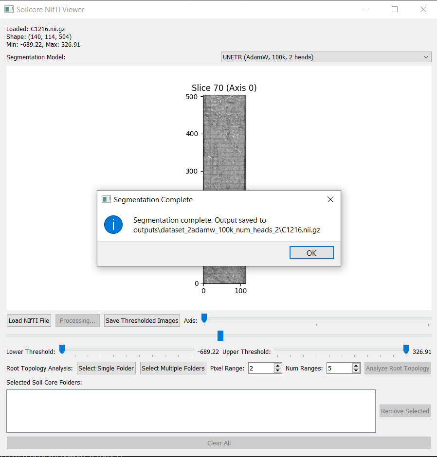
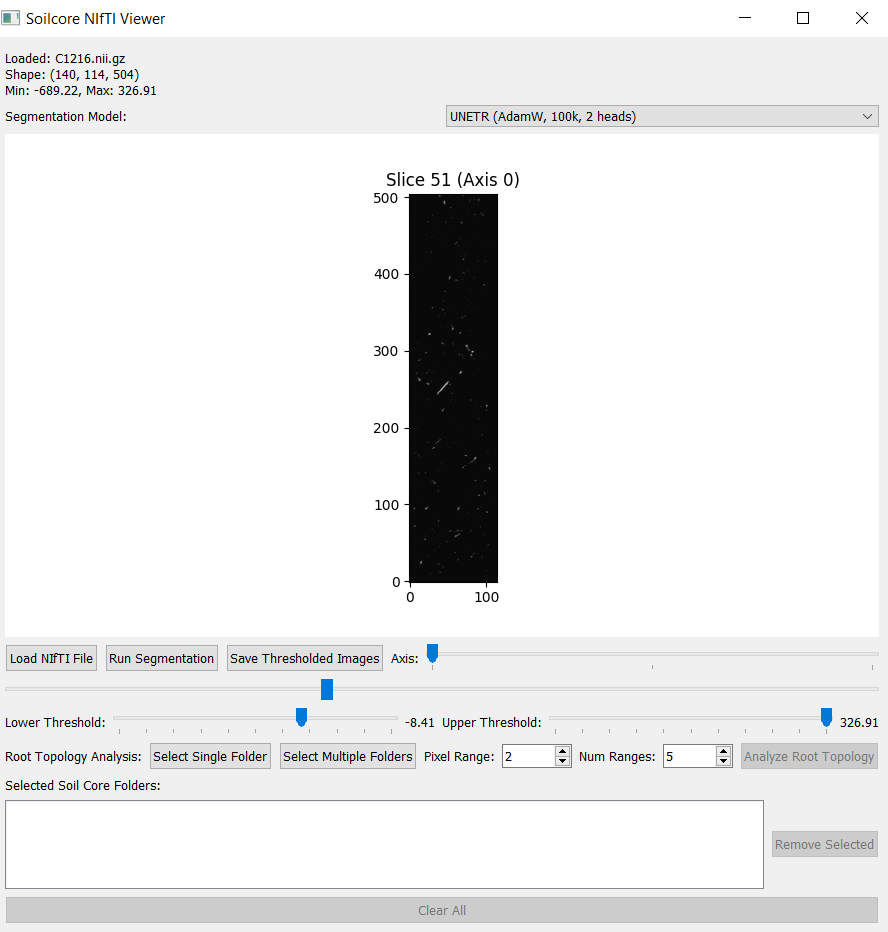
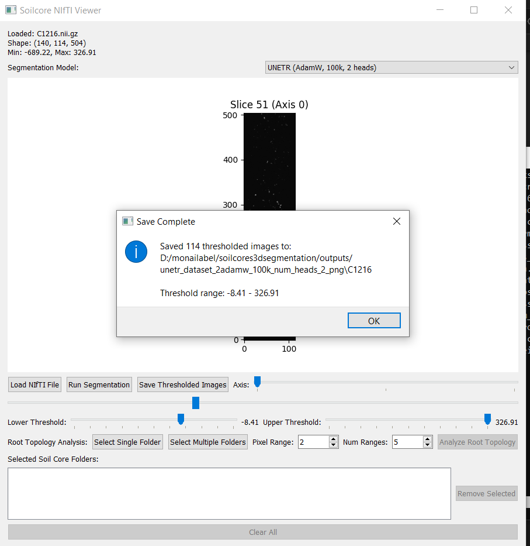
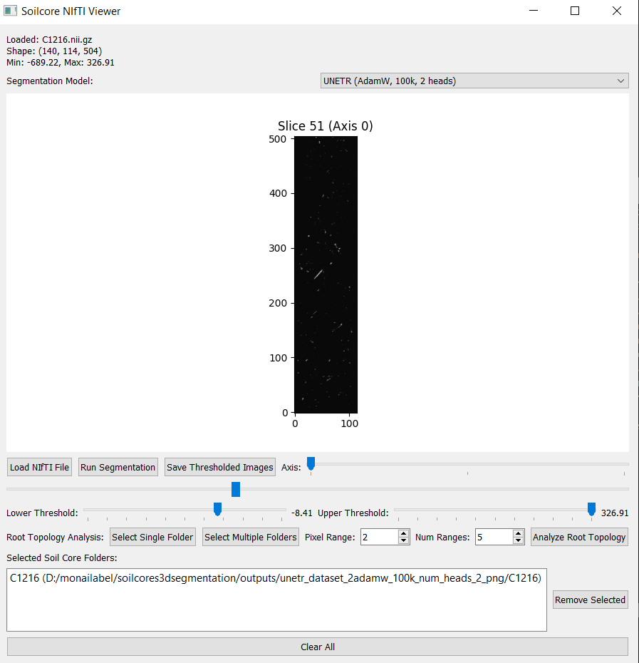
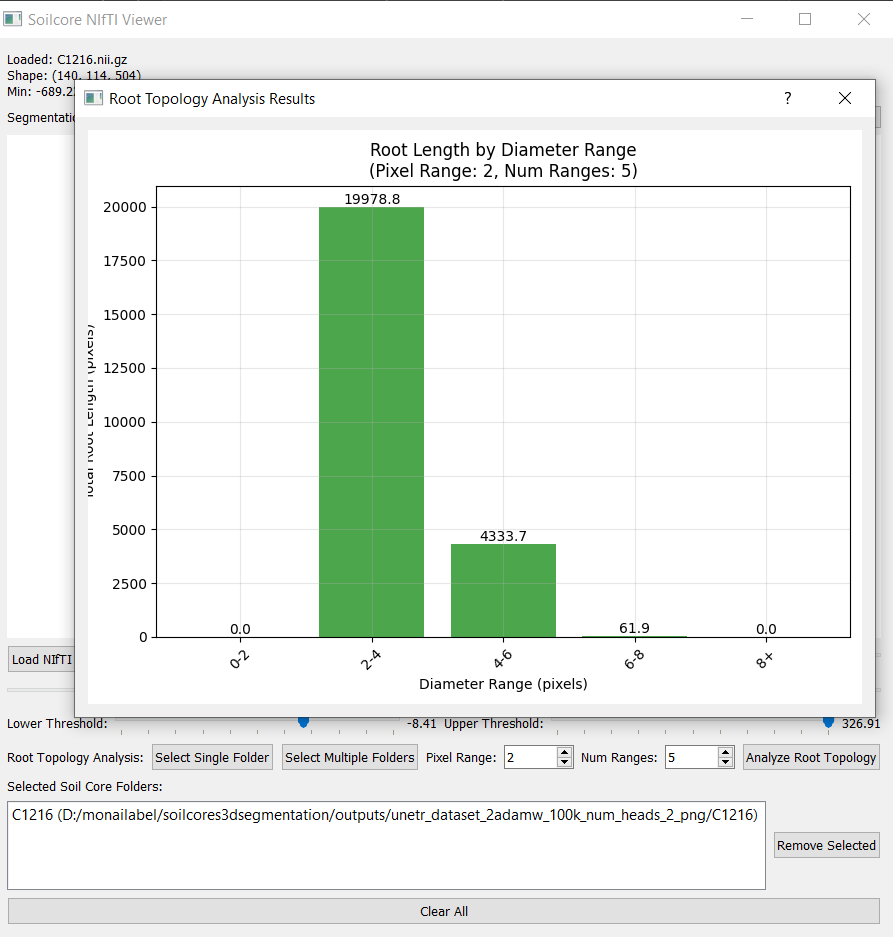

# Visualizing and Quantifying Plant Root Distribution in Soils: A CT Scan and Machine Learning Approach

## Environment Setup

### Using Conda

1. Create a new conda environment:
```bash
conda create -n soilcores python=3.10
```

2. Activate the environment:
```bash
conda activate soilcores
```

3. Install required packages:
```bash
pip install -r requirements.txt
```

## Using the GUI to Segment and Analyze Soil Core CT Scans

This section describes how to use the `Soilcore NIfTI Viewer` graphical interface to load, segment, threshold, and analyze 3D CT scans for root topology. We illustrate this with the sample file `C1216.nii.gz`.

---

### **Step 1: Upload the CT Scan Raw Data**

Click on **"Load NIfTI File"** and choose a `.nii` or `.nii.gz` file from your dataset (e.g., `C1216.nii.gz`).



---

### **Step 2: Select the Soil Core File**

From the file browser, locate your CT scan file (e.g., `C1216.nii.gz` in the folder `test/`) and click **Open**.



---

### **Step 3: Visualize the Raw Data**

Once loaded, the middle slice of the scan will be shown. Use the **"Axis"** slider to change the orientation and the **bottom slider** to scroll through slices.



---

### **Step 4: Choose a Segmentation Model**

Select one of the available models in the **Segmentation Model** dropdown. For example, choose `UNETR (AdamW, 100k, 2 heads)`.

Click **"Run Segmentation"** to start. A message will appear once the segmentation is complete.



---

### **Step 5: Apply a Threshold**

Adjust the **Lower Threshold** and **Upper Threshold** sliders to filter out unwanted noise or background.



---

### **Step 6: Choose a Path to Save Thresholded Images**

Click **"Save Thresholded Images"**, then choose the directory where the binary PNG slices will be stored. A confirmation will appear once the images are saved.



---

### **Step 7: Select Folder with Saved Thresholded Images**

Use the **"Select Single Folder"** or **"Select Multiple Folders"** buttons under *Root Topology Analysis* to load the folder(s) with the thresholded images.



---

### **Step 8: Get Root Topology Results**

Click **"Analyze Root Topology"**. A bar chart will appear showing the total root length for different diameter ranges. CSV and PNG files are also saved in the output directory.

